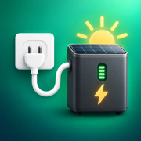

<p align="center">
  
</p>

<h1 align="center">Solarbank AC-Laderechner</h1>

<p align="center">
  Ein kompakter, mobil optimierter Wirtschaftlichkeitsrechner für die AC-Aufladung der Anker SOLIX Solarbank 3 E2700 Pro und Solarbank 4 E5000 Pro.
</p>

<p align="center">
  <a href="https://alxbcr82.github.io/solarbatterie-rechner/"><strong>Live-App öffnen</strong></a>
</p>

## Worum geht es?

Dynamische Stromtarife machen es möglich, die Solarbank in günstigen Stunden aus dem Netz zu laden und die gespeicherte Energie später selbst zu verbrauchen. Durch Lade-, Speicher- und Wechselrichterverluste ist jedoch nicht jeder Preisunterschied automatisch wirtschaftlich.

Der Rechner beantwortet deshalb eine einfache Frage:

> Wie hoch muss der spätere Strompreis mindestens sein, damit sich das AC-Laden zu einem bestimmten Preis lohnt?

Der Ladepreis wird mit einem Schieberegler eingestellt. Das Ergebnis aktualisiert sich sofort und lässt sich direkt mit den späteren Stundenpreisen des eigenen Stromtarifs vergleichen.

## Funktionen

- Für Smartphone und Desktop optimierte Benutzeroberfläche
- Direkte Berechnung ohne Registrierung oder Server
- Deutsche Dezimalkommas werden unterstützt
- Drei Rechenprofile für unterschiedliche Betrachtungsweisen
- Geräteprofile für Solarbank 3 E2700 Pro und Solarbank 4 E5000 Pro
- Speicherkonfiguration mit BP2700 oder BP5000
- Frei anpassbarer Gesamtwirkungsgrad
- Optionale Berücksichtigung von Batterieverschleiß und gewünschtem Kostenvorteil
- Jahreshochrechnung für Netzbezug, nutzbare Energie und Ersparnis
- Installation auf dem iPhone-Home-Bildschirm mit eigenem App-Icon
- Automatische Darstellung im hellen oder dunklen Systemdesign
- Keine Cookies, Werbung, Analyse- oder Trackingdienste

## Bedienung

1. Bei Bedarf einmalig Solarbank und Erweiterungsakkus unter **Speicher konfigurieren** auswählen.
2. Den vollständigen Endkundenpreis einer günstigen Stunde aus der Tarif-App ablesen.
3. Diesen Wert mit dem Schieberegler als **AC-Ladepreis** einstellen.
4. Das gewünschte Rechenprofil auswählen.
5. Den angezeigten Mindestpreis mit einem späteren Strompreis vergleichen.

Ist der spätere vollständige Endkundenpreis mindestens so hoch wie das Ergebnis, ist das Laden nach dem gewählten Profil wirtschaftlich.

### Beispiel

Im Profil **Praxis** ergeben 20 ct/kWh Ladepreis einen notwendigen späteren Strompreis von 28,32 ct/kWh:

- Späterer Preis 32 ct/kWh: Laden lohnt sich.
- Späterer Preis 27 ct/kWh: Laden lohnt sich nicht.

## Rechenmodell

Die App verwendet folgende Formel:

```text
Mindestpreis später = Ladepreis / Gesamtwirkungsgrad
                      + Batterieverschleiß
                      + gewünschter Kostenvorteil
```

Der Wirkungsgrad ist als vollständiger AC-Round-Trip zu verstehen:

```text
Steckdose → Ladeelektronik → Akku → Wechselrichter → Hausnetz
```

### Rechenprofile

| Profil | Gesamtwirkungsgrad | Verschleiß | Sicherheitsvorteil | Verwendung |
|---|---:|---:|---:|---|
| Praxis | 79 % | 2 ct/kWh | 1 ct/kWh | Empfohlene Alltagseinstellung |
| Konservativ | 75 % | 3 ct/kWh | 2 ct/kWh | Niedrige Entladeleistung oder längere Speicherzeit |
| Nur Energie | 79 % | 0 ct/kWh | 0 ct/kWh | Reine Betrachtung der Energieverluste |

Die Werte können im erweiterten Bereich individuell geändert werden.

### Unterstützte Speicherkonfigurationen

| Gerät oder Akku | Nennkapazität |
|---|---:|
| Solarbank 3 E2700 Pro | 2,688 kWh |
| Solarbank 4 E5000 Pro | 5,024 kWh |
| BP2700 | 2,688 kWh |
| BP5000 | 5,024 kWh |

BP2700 und BP5000 können für beide Solarbank-Modelle ausgewählt werden. Die App berücksichtigt bis zu fünf Erweiterungsakkus eines Typs. Die ermittelte Nennkapazität dient als Ausgangswert für die Jahreshochrechnung; ein tatsächlich am Stromzähler gemessener Netzbezug kann dort weiterhin von Hand eingetragen werden.

## Welche Strompreise gehören in den Rechner?

Verwendet werden sollten vollständige variable Endkundenpreise. Dazu zählen insbesondere:

- Energie- beziehungsweise Börsenpreis
- Aufschlag des Stromanbieters
- variable Netzentgelte
- Steuern, Abgaben und Umlagen
- Umsatzsteuer

Monatliche Grundgebühren gehören nur dann in die Rechnung, wenn sie durch das Laden zusätzlich entstehen. Ein reiner Börsenpreis aus einer Energie-App ist normalerweise nicht ausreichend.

## Auf dem iPhone installieren

1. Die [Live-App](https://alxbcr82.github.io/solarbatterie-rechner/) in Safari öffnen.
2. Das Teilen-Symbol antippen.
3. **Zum Home-Bildschirm** auswählen.
4. Den vorgeschlagenen Namen bestätigen.

Die App erscheint anschließend mit eigenem Icon auf dem Home-Bildschirm und öffnet sich ohne störende Browsernavigation.

## Datenschutz

Die Anwendung besteht ausschließlich aus statischem HTML, CSS und JavaScript. Sämtliche Eingaben und Berechnungen verbleiben im Browser. Nur die gewählte Solarbank- und Akkukonfiguration wird dort lokal für den nächsten Aufruf gespeichert. Es gibt keine eigenen Cookies, Formulare, Analyse- oder Trackingdienste. Beim Abruf über GitHub Pages verarbeitet der Hostinganbieter technisch erforderliche Verbindungsdaten. Einzelheiten stehen in den [Datenschutzhinweisen](https://alxbcr82.github.io/solarbatterie-rechner/datenschutz.html).

## Technische Umsetzung

- Vanilla HTML, CSS und JavaScript
- Keine Frameworks oder externen Laufzeitabhängigkeiten
- Bereitstellung über GitHub Pages
- Responsive Layout und Unterstützung für iPhone-Safe-Areas
- Apple-Touch-Icon für den Home-Bildschirm

### Lokal ausführen

Für die Entwicklung reicht ein beliebiger lokaler Webserver, zum Beispiel:

```bash
python3 -m http.server 8000
```

Danach ist die App unter `http://localhost:8000` erreichbar. Alternativ kann `index.html` auf Desktop-Browsern direkt geöffnet werden.

## Projektstruktur

```text
.
├── index.html             # Vollständige Anwendung
├── apple-touch-icon.png   # App- und Browser-Icon
├── favicon-16x16.png      # Kleines Browser-Icon
├── favicon-32x32.png      # Browser-Icon
├── icon-192.png           # Installations-Icon
├── icon-512.png           # Hochauflösendes Installations-Icon
├── site.webmanifest       # Metadaten für installierbare Web-Apps
├── datenschutz.html       # Hinweise zur Datenverarbeitung
├── LICENSE                # MIT-Lizenz
└── README.md              # Projektdokumentation
```

## Grenzen des Rechners

Das Ergebnis ist eine wirtschaftliche Orientierung und keine Garantie für eine konkrete Ersparnis. Der tatsächliche Wirkungsgrad kann unter anderem von Ladeleistung, Entladeleistung, Temperatur, Ladezustand und Speicherdauer abhängen. Wirtschaftlich ist die Rechnung außerdem nur, wenn die gespeicherte Energie später im Haushalt genutzt und nicht unvergütet in das öffentliche Netz abgegeben wird.

## Hinweis

Dies ist ein privates, unabhängiges Hilfsmittel und keine offizielle Anwendung von Anker oder Anker SOLIX. Produkt- und Markennamen dienen ausschließlich der eindeutigen Beschreibung des vorgesehenen Einsatzbereichs.

Die Ergebnisse sind unverbindliche Näherungswerte. Für Richtigkeit, Vollständigkeit und Aktualität wird keine Gewähr übernommen. Das Tool stellt keine Energie-, Finanz- oder Anlageberatung dar; Nutzung und daraus abgeleitete Entscheidungen erfolgen in eigener Verantwortung.

## Lizenz

Der Quellcode und die zum Projekt gehörenden Dateien stehen unter der [MIT-Lizenz](./LICENSE). Sie dürfen damit verwendet, verändert und weitergegeben werden, solange der Copyright- und Lizenzhinweis erhalten bleibt.
